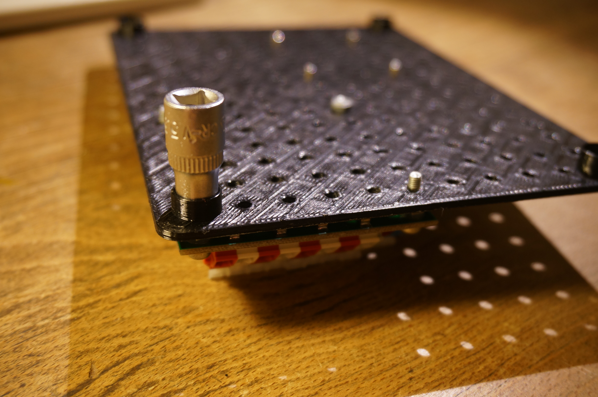

## PLBASE1113 

This base board has size 11x13 holes and standard MLAB grid 400mils (10.16mm). It is especially suited for simple measuring instruments and mobile robots constructions. The board can be prited at almost any 3D printer.

 
